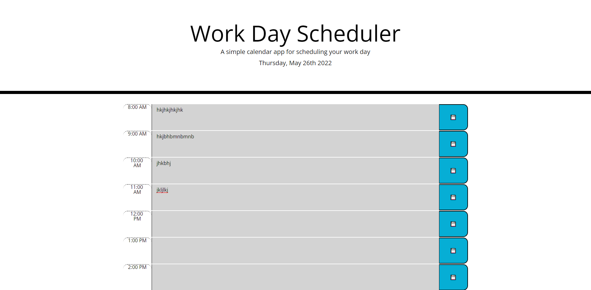

# 05 Third Party APIs: Work Day Scheduler
 
## Description
 
This project is a single webpage that consists of a calendar that allows users to schedule their day

Users can store events for the working hours of the day in the browsers and have them readily available throughout the day. This project can be used as a daily time management tool similar to a todo list, but with the added functions of scheduling tasks.
 
## Usage
 
The website is live on the open web and can be accessed at https://abdallajama201.github.io/Challenge-05-Third-Party-APIs/

When a user opens the webpage the are presented with the current date and a block column of blocks. Each block represents a working hour of the day in chronological order. The current hour is marked red, while previous hours are gray and the future hours are green. A user can type their appointment into any block and save it by pressing the adjacent icon in that block. If the user refreshes the screen or returns later that appointment will be saved. 

A photo of the mockup is available below.
 

  
## Credits
 
The original webpage was provided by [Trilogy Education Services](https://www.trilogyed.com/universities/) and the [School of Continuing Studies - University of Toronto](https://learn.utoronto.ca/)
 
## License
 
 This project is under the MIT License with language provided by the Open Source Initiative.
